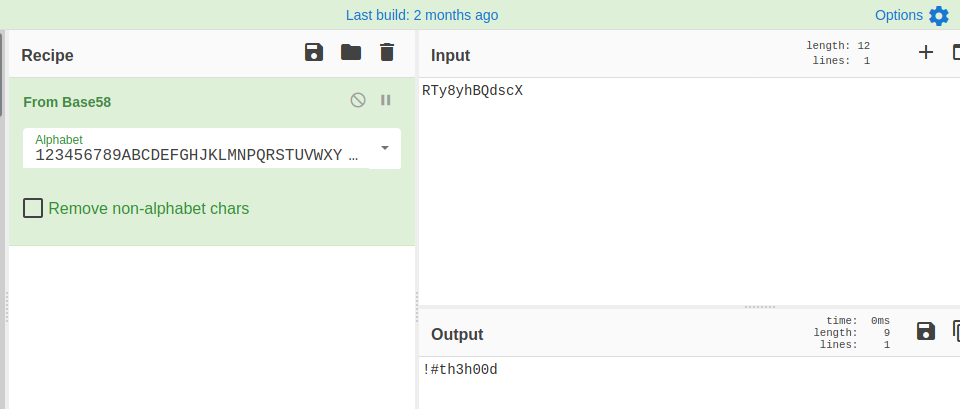
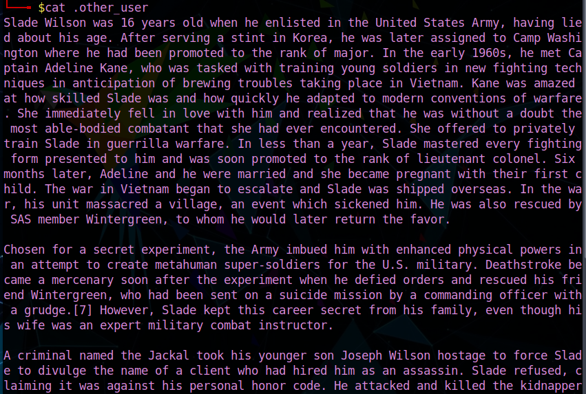

#Lian_Yu

This is a writeup for the room [Lian_Yu by Deamon at TryHackMe](https://tryhackme.com/room/lianyu)

I used Parrot OS to complet the room, so there might be a difference of syntax in the commands!

The target IP for me was 10.10.166.110 and that is what you will be seeing through my screenshots. Just replace by the target IP given to you when you deploy the machine.

Have fun!! 

`CryptoTzipi aka CyberLola`

We will start with our host enumeration by using nmap with the following command

`nmap -sC -A <IP> -T 4`

(the -T 4 switch is just to speed up things a little bit)

Port 21 (FTP), 22(SSH) and 80(HTTP) are open.
I did try to check it FTP would let me login as anonymous, but it didn't :((

Next we head over the browser to check the web page...

We check the page source, as always ...

Nothing really useful here so let's see if we find any hidden directories via gobuster

`gobuster dir -u http://IP -w /usr/share/wordlists/dirbuster/directory-list-2.3-medium.txt`

And we find an interesting directory here!! By peeking at it in the browser we see

Something seems missing ... but by highlighting all the text...

AHA! :)

Doing further directory enumeration ...

`gobuster dir -u http://IP/island -w /usr/share/wordlists/dirbuster/directory-list-2.3-medium.txt`

and we find ...

Checking the page source for this, we see a weird comment!!

OK... hehehe...this part got me nicely!! And I admittedly spent way too much time trying to figure it out, when all I had to do was look at it REALLY closely o^_^o NO, you are not supposed to go looking for a ticket somewhere!! It is a DOTticket ...".ticket" and when you finally figure out that this is a file extension, you feel REALLY silly!! Been there, done that so I am here to save you the aggravationg and to really recommend that you learn to look at this kind of think in EVERY detail possible!! I learned a lesson and I hope I can help you learn it as well :))

`gobuster dir -u http://IP/island/2100 -w /usr/share/wordlists/dirbuster/directory-list-2.3-medium.txt -x ticket`

Putting your new finding in the browser...

Let's use Cyber Chef (awesome tool, one of my favorites!) to decode that!!

EXCELLENT!! Now we have some credentials so let's attempt to login to FTP again, but now using the credentials we found

SUCCESS!! We look around, see some files and transfer them into our machine

Going through them..

"slade" appears a lot reading this text! Hmmm..password?Username?

Checking Leave_me_alone.png answered the previous question!!

But this is a password for what?? Hahaha... I did try to SSH using it, but it wouldn't be so easy now, would it? Of course it didn't work :((

Back to checking the rest of the files we took from FTP!

Remember that picture we just saw? Yup, VERY useful here!! :))

That last command? `cat shado` will give you the SSH password :))

Perfect! Now using the SSH credentials we found, we can finally SSH into our victim!!

You know the drill for the user.txt

`cat user.txt`

Now, going for some privesc, usually my first step is checking `sudo -l` to see if the current user can run anything as root

Checking the VERY useful GTFO bins repository here on github

YAY!!!!!

And we are DONE!! :)

I hope this writeup was helpful!

Happy Hacking

                                    
                                    `CryptoTzipi aka CyberLola`

